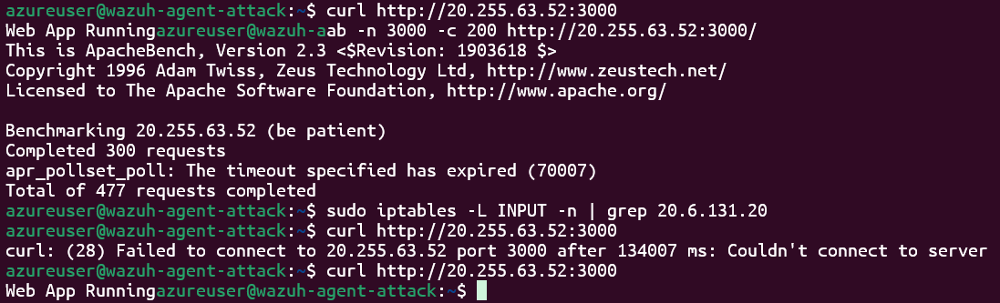
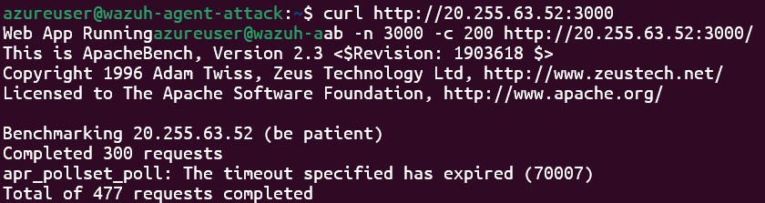
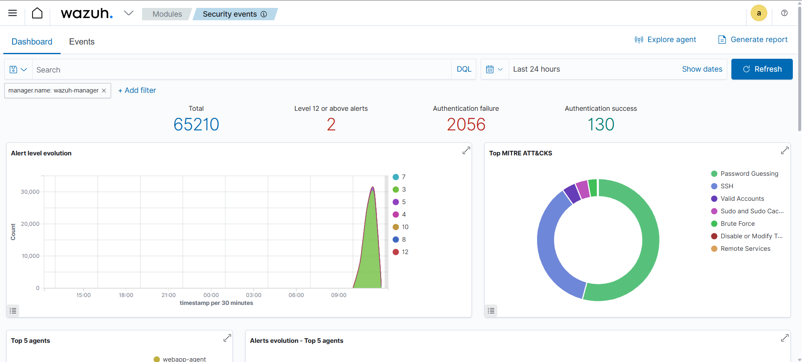
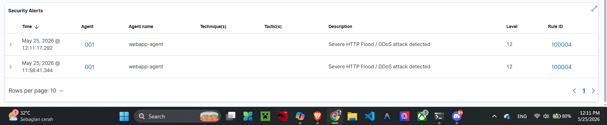
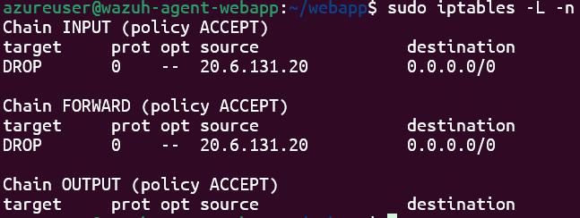
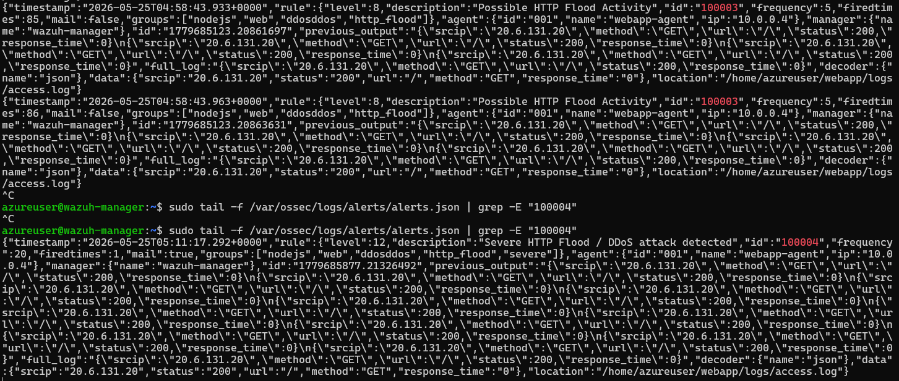
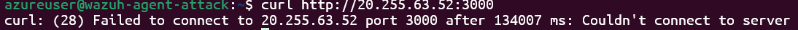

# Implementasi SOAR Menggunakan Wazuh untuk Deteksi dan Mitigasi Serangan DDoS

# 👥 Anggota Kelompok 10

| Nama | NRP |
|--------|--------|
| Evan Christian Nainggolan | 5027241026 |
| Rizqi Akbar Sukirman Putra | 5027241044 |

---

# 📚 Teknologi yang Digunakan

- Wazuh SIEM
- Wazuh Agent
- Active Response
- Node.js
- Express.js
- Morgan Logger
- ApacheBench (ab)
- iptables
- Linux Server

---

## 📌 Deskripsi Proyek

Proyek ini merupakan implementasi konsep **Security Orchestration, Automation, and Response (SOAR)** menggunakan **Wazuh SIEM** untuk mendeteksi dan memitigasi serangan **Distributed Denial of Service (DDoS)** secara otomatis.

Sistem memonitor log aplikasi web berbasis Node.js, mendeteksi aktivitas HTTP Flood menggunakan custom rule Wazuh, kemudian secara otomatis menjalankan **Active Response** untuk memblokir alamat IP penyerang melalui firewall.

---

## 🎯 Tujuan

- Memonitor log aplikasi web menggunakan Wazuh Agent.
- Mendeteksi aktivitas HTTP Flood secara otomatis.
- Menghasilkan alert dengan tingkat keparahan tinggi (Level 12).
- Mengotomatisasi proses mitigasi menggunakan Active Response.
- Memblokir IP penyerang secara otomatis menggunakan firewall.
- Mengimplementasikan konsep SOAR dalam lingkungan SOC sederhana.

---

# 🏗️ Arsitektur Sistem

## Komponen Sistem

| Komponen | Fungsi |
|-----------|---------|
| Wazuh Manager | Menerima log, melakukan analisis, dan menjalankan Active Response |
| Webapp Agent | Menjalankan aplikasi Node.js dan mengirim log ke Manager |
| Attacker Machine | Menjalankan ApacheBench untuk mensimulasikan HTTP Flood |

---

## Alur Sistem

```text
Attacker
    │
    ▼
Node.js Web Application
    │
    ▼
access.log
    │
    ▼
Wazuh Agent
    │
    ▼
Wazuh Manager
    │
    ▼
Custom Rule Detection
    │
    ▼
Active Response
    │
    ▼
Firewall (iptables)
    │
    ▼
IP Attacker Blocked
```

---

# ⚙️ Implementasi Sistem

## 1. Aplikasi Web Node.js

Aplikasi web dibuat menggunakan:

- Express.js
- Morgan Logging Middleware

Morgan dikonfigurasi untuk menghasilkan log JSON yang berisi:

- Source IP
- HTTP Method
- URL
- HTTP Status
- Response Time

### Contoh Log

```json
{
  "srcip":"20.6.131.20",
  "method":"GET",
  "url":"/",
  "status":"200",
  "response_time":"0.169"
}
```

### Lokasi Log

```bash
/home/azureuser/webapp/logs/access.log
```

---

## 2. Monitoring Log oleh Wazuh Agent

Konfigurasi pada Agent:

```xml
<localfile>
  <log_format>json</log_format>
  <location>/home/azureuser/webapp/logs/access.log</location>
</localfile>
```

Log yang diterima akan muncul pada:

```bash
/var/ossec/logs/archives/archives.json
```

---

# 🚨 Custom Rule DDoS Detection

File konfigurasi:

```bash
/var/ossec/etc/rules/local_rules.xml
```

---

## Rule 100002

Mendeteksi seluruh request HTTP.

```xml
<rule id="100002" level="3">
  <decoded_as>json</decoded_as>
  <description>NodeJS HTTP Request</description>
  <group>nodejs,http,web</group>
</rule>
```

---

## Rule 100004

Mendeteksi HTTP Flood berdasarkan frekuensi request.

```xml
<rule id="100004"
      level="12"
      frequency="20"
      timeframe="20"
      ignore="60">

  <if_matched_sid>100002</if_matched_sid>

  <same_srcip />

  <description>
    Severe HTTP Flood / DDoS attack detected
  </description>

  <group>ddos,http_flood,severe</group>

</rule>
```

### Rule Aktif Jika

- Minimal 20 request
- Dalam 20 detik
- Dari IP yang sama

---

# 🤖 Implementasi SOAR

## Active Response

Konfigurasi Active Response:

```xml
<active-response>
  <command>firewall-drop</command>
  <location>defined-agent</location>
  <agent_id>001</agent_id>
  <rules_id>100004</rules_id>
  <timeout>600</timeout>
</active-response>
```

### Penjelasan

| Parameter | Fungsi |
|------------|---------|
| firewall-drop | Menjalankan pemblokiran firewall |
| defined-agent | Menjalankan response pada Webapp Agent |
| agent_id=001 | Target Webapp Agent |
| rules_id=100004 | Trigger saat DDoS terdeteksi |
| timeout=600 | Pemblokiran selama 10 menit |

---

## Firewall Auto Blocking

Ketika Rule 100004 aktif:

```text
Alert Level 12
      ↓
Active Response
      ↓
firewall-drop
      ↓
iptables
      ↓
IP Attacker Blocked
```

Contoh rule yang ditambahkan:

```bash
DROP all -- 20.6.131.20 anywhere
```

Setelah 600 detik, rule akan dihapus otomatis.

---

# 🧪 Simulasi Serangan

Serangan dilakukan menggunakan ApacheBench.

## Pengujian 1

```bash
ab -n 5000 -c 300 http://20.255.63.52:3000/
```

### Hasil

```text
Requests per second: 1470.17
Complete requests: 5000
Failed requests: 0
```

---

## Pengujian 2

```bash
ab -n 5000 -c 50 -t 60 http://20.255.63.52:3000/
```

Metode ini memberikan tekanan yang lebih stabil sehingga Wazuh dapat melakukan korelasi log dengan lebih baik.

---

# 📊 Hasil Pengujian

## 1. Deteksi Log

Wazuh berhasil membaca log JSON dari aplikasi Node.js.

Contoh decoding:

```text
srcip: 20.6.131.20
method: GET
url: /
status: 200
```

---

## 2. Alert Generation

Rule 100002 berhasil menghasilkan alert untuk setiap request HTTP.

Rule 100004 menghasilkan alert:

```text
Severe HTTP Flood / DDoS attack detected
```

Severity:

```text
Level 12
```

---

## 3. Active Response

Setelah Alert Level 12 muncul:

```text
firewall-drop executed
```

Wazuh mengirimkan perintah Active Response ke Webapp Agent.

---

## 4. Auto Blocking

Firewall berhasil memblokir IP penyerang menggunakan:

```bash
iptables
```

Mitigasi dilakukan secara otomatis tanpa campur tangan administrator.

---

# 🔧 Troubleshooting

## 1. Typo pada Rule

Salah:

```xml
<same_scrip />
```

Benar:

```xml
<same_srcip />
```

---

## 2. Korelasi JSON Tidak Berjalan

Salah:

```xml
<same_field>data.srcip</same_field>
```

Benar:

```xml
<same_srcip />
```

---

## 3. Rule Escalation Tidak Tercapai

Sebelumnya:

```xml
<if_matched_sid>100003</if_matched_sid>
```

Diubah menjadi:

```xml
<if_matched_sid>100002</if_matched_sid>
```

---

## 4. Active Response Berjalan pada Host yang Salah

Sebelumnya:

```xml
<location>local</location>
```

Firewall dijalankan pada Manager.

Diubah menjadi:

```xml
<location>defined-agent</location>
```

Firewall dijalankan pada Webapp Agent.

---

# ✅ Kesimpulan

Berdasarkan hasil implementasi dan pengujian:

1. Wazuh berhasil digunakan sebagai platform SIEM untuk monitoring log aplikasi web.
2. Custom rule berhasil mendeteksi aktivitas HTTP Flood yang menyerupai serangan DDoS.
3. Alert Level 12 berhasil dihasilkan ketika threshold tercapai.
4. Active Response berhasil mengotomatisasi proses mitigasi.
5. Firewall mampu memblokir IP penyerang secara otomatis.
6. Konsep SOAR berhasil diterapkan melalui integrasi deteksi, analisis, dan respons otomatis terhadap ancaman keamanan.

Implementasi ini menunjukkan bahwa Wazuh tidak hanya berfungsi sebagai alat monitoring, tetapi juga sebagai solusi otomatisasi respons insiden yang efektif dalam lingkungan Security Operations Center (SOC).

---

# 📸 Dokumentasi

|Foto|Keterangan|
|---|---|
||Webbapp still running before the attack|
||Attacking the webbapp then failed due to active response|
||Dashboard after the attack|
||DDoS detected in the Dashboard|
||IP attacker dropped by active response|
||The alerts that comes out when the attack happens|
||The Attacker cannot access the webapp after the drop|
